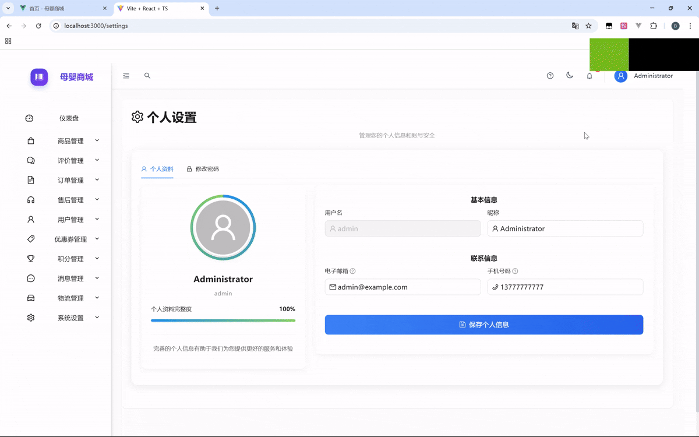

# 母婴商城后台管理系统 (React + TypeScript)

<p align="center">
  
  
  
  
  
  
  
  

<p align="center">基于React和TypeScript构建的现代化母婴商城后台管理系统，集成Ant Design和TailwindCSS，提供全面的商品、订单、用户及数据分析管理功能。</p>


## 📋 目录

- [功能特性](#功能特性)
- [技术栈](#技术栈)
- [项目结构](#项目结构)
- [快速开始](#快速开始)
- [功能模块](#功能模块)
- [架构设计](#架构设计)
- [API接口](#api接口)
- [主题与样式](#主题与样式)
- [开发指南](#开发指南)
- [常见问题](#常见问题)
- [版本历史](#版本历史)
- [贡献指南](#贡献指南)
- [许可证](#许可证)

## ✨ 功能特性

### 🌟 核心特性

- **响应式设计**：支持从手机到大屏幕的多设备自适应布局
- **主题切换**：内置浅色和深色主题，支持自动识别系统主题偏好
- **权限控制**：基于角色的精细化权限管理系统
- **数据可视化**：丰富的图表和数据展示组件
- **动画效果**：流畅的页面过渡和组件交互动画
- **国际化**：多语言支持框架
- **自动化表单**：强大的表单生成和验证系统

### 🔥 业务功能

- **数据分析仪表盘**：实时监控商城运营数据
- **用户管理**：用户信息管理、会员等级设置
- **商品管理**：商品分类、品牌、属性及SKU管理
- **订单管理**：订单处理、状态跟踪、批量操作
- **库存管理**：实时库存监控、入库出库管理
- **优惠券管理**：多种优惠券类型创建和发放
- **物流管理**：物流公司维护、配送追踪
- **售后服务**：退款退货处理、售后统计
- **积分系统**：会员积分规则设置与管理
- **消息中心**：系统通知、用户消息管理
- **内容管理**：营销内容编排、SEO优化
- **系统设置**：全局参数配置、缓存管理

## 🛠️ 技术栈

### 前端框架

- **React 19**：用于构建用户界面的JavaScript库
- **TypeScript 5.8**：添加静态类型检查的JavaScript超集
- **React Router 7.6**：声明式路由管理
- **Redux Toolkit 2.8**：Redux的官方工具集，简化状态管理

### UI组件和样式

- **Ant Design 5.25**：企业级UI组件库
- **TailwindCSS 3.4**：实用优先的CSS框架
- **Framer Motion**：React动画库
- **Ant Design Charts/ECharts**：数据可视化图表库

### 开发和构建工具

- **Vite 6.3**：下一代前端构建工具
- **ESLint 9.25**：JavaScript和TypeScript代码检查工具
- **SWC**：高性能JavaScript/TypeScript编译器
- **PostCSS**：CSS处理工具

### 网络和数据处理

- **Axios**：基于Promise的HTTP客户端
- **Day.js**：轻量级日期处理库
- **Recharts**：基于React的图表库

### 辅助工具

- **clsx/tailwind-merge**：条件类名工具
- **Heroicons/Lucide**：SVG图标库

<div align="right">[ <a href="#目录">返回顶部 ⬆</a> ]</div>

## 📂 项目结构

本项目采用模块化的目录结构，清晰分离不同功能模块：

```
muying-admin-react/
├── public/                # 静态资源目录
│   ├── favicon.ico        # 网站图标
│   └── ...                # 其他静态资源
├── src/                   # 源代码目录
│   ├── api/               # API接口定义
│   │   ├── auth.ts        # 认证相关API
│   │   ├── user.ts        # 用户相关API
│   │   ├── product.ts     # 商品相关API
│   │   └── ...            # 其他API模块
│   ├── assets/            # 项目资源文件
│   │   ├── images/        # 图片资源
│   │   └── icons/         # 图标资源
│   ├── components/        # 可复用组件
│   │   ├── animations/    # 动画组件
│   │   ├── ui/            # UI基础组件
│   │   └── business/      # 业务组件
│   ├── layout/            # 布局组件
│   │   ├── components/    # 布局子组件
│   │   ├── index.tsx      # 主布局文件
│   │   └── menu.tsx       # 菜单配置
│   ├── router/            # 路由配置
│   │   └── index.tsx      # 路由定义
│   ├── store/             # Redux状态管理
│   │   ├── slices/        # Redux切片
│   │   └── index.ts       # Store配置
│   ├── styles/            # 全局样式
│   │   ├── variables.css  # CSS变量
│   │   └── global.css     # 全局样式定义
│   ├── theme/             # 主题配置
│   │   ├── dark.ts        # 深色主题
│   │   └── light.ts       # 浅色主题
│   ├── types/             # TypeScript类型定义
│   │   ├── api.ts         # API相关类型
│   │   └── models.ts      # 数据模型类型
│   ├── utils/             # 工具函数
│   │   ├── request.ts     # Axios请求封装
│   │   ├── auth.ts        # 认证工具
│   │   └── format.ts      # 格式化工具
│   ├── views/             # 页面组件
│   │   ├── dashboard/     # 仪表盘页面
│   │   ├── login/         # 登录页面
│   │   ├── user/          # 用户管理页面
│   │   ├── product/       # 商品管理页面
│   │   └── ...            # 其他页面模块
│   ├── App.tsx            # 应用入口组件
│   └── main.tsx           # 应用入口文件
├── .eslintrc.js           # ESLint配置
├── .gitignore             # Git忽略文件
├── CHANGELOG.md           # 变更日志
├── package.json           # 项目依赖配置
├── postcss.config.js      # PostCSS配置
├── tailwind.config.js     # TailwindCSS配置
├── tsconfig.json          # TypeScript配置
└── vite.config.ts         # Vite构建配置
```

### 核心文件说明

| 文件/目录 | 说明 |
|----------|------|
| `src/api/` | 包含所有后端API调用的封装，按业务模块分类 |
| `src/components/` | 可复用组件库，包括UI基础组件和业务组件 |
| `src/layout/` | 页面布局相关组件，包括导航栏、侧边栏等 |
| `src/router/` | 路由配置，定义应用的页面导航结构 |
| `src/store/` | Redux状态管理，包含各业务模块的状态切片 |
| `src/utils/` | 通用工具函数，如请求封装、格式化函数等 |
| `src/views/` | 应用的所有页面组件，按业务模块组织 |
| `vite.config.ts` | Vite构建工具配置，包含开发服务器设置、构建优化等 |
| `tailwind.config.js` | TailwindCSS配置文件，定义样式主题和扩展 |

<div align="right">[ <a href="#目录">返回顶部 ⬆</a> ]</div>

## 🚀 快速开始

### 环境要求

- Node.js 18.0+ (推荐使用最新的LTS版本)
- npm 8.0+ 或 yarn 1.22+ 或 pnpm 7+

### 克隆仓库

```bash
git clone https://github.com/your-username/muying-admin-react.git
cd muying-admin-react
```

### 安装依赖

使用npm:

```bash
npm install
```

使用yarn:

```bash
yarn install
```

使用pnpm:

```bash
pnpm install
```

### 启动开发服务器

```bash
npm run dev
# 或
yarn dev
# 或
pnpm dev
```

应用将在 http://localhost:3000 运行，支持热模块替换(HMR)。

### 构建生产版本

```bash
npm run build
# 或
yarn build
# 或
pnpm build
```

构建产物将输出到 `dist` 目录。

### 预览生产构建

```bash
npm run preview
# 或
yarn preview
# 或
pnpm preview
```

### 开发环境配置

项目使用Vite的代理功能连接后端API。默认配置中，API请求会被代理到 `http://localhost:8080`。你可以在 `vite.config.ts` 文件中修改这些设置：

```typescript
// vite.config.ts
export default defineConfig({
  // ...其他配置
  server: {
    port: 3000,
    proxy: {
      '/admin': {
        target: 'http://your-api-server.com',
        changeOrigin: true,
        rewrite: (path) => `/api${path}`
      },
      // 其他代理配置...
    }
  }
})
```

### 环境变量

创建 `.env.local` 文件（不会被Git跟踪）来设置本地环境变量：

```
# .env.local 示例
VITE_API_BASE_URL=http://localhost:8080
VITE_APP_TITLE=母婴商城管理系统(开发)
```

可用的环境变量:

| 变量名 | 说明 | 默认值 |
|-------|------|-------|
| `VITE_API_BASE_URL` | API服务器基础URL | `http://localhost:8080` |
| `VITE_APP_TITLE` | 应用标题 | `母婴商城后台管理系统` |
| `VITE_ENABLE_MOCK` | 是否启用Mock数据 | `false` |

<div align="right">[ <a href="#目录">返回顶部 ⬆</a> ]</div>

## 开发指南

### 代码规范

本项目使用ESLint和TypeScript进行代码规范检查。运行以下命令检查代码：

```bash
npm run lint
# 或
yarn lint
# 或
pnpm lint
```

### 开发工作流

1. 创建功能分支
2. 提交代码
3. 创建Pull Request
4. 代码审查
5. 合并到主分支

### 组件开发规范

- 组件文件应使用PascalCase命名方式
- 组件应尽可能使用函数组件和React Hooks
- 公共组件应放置在`src/components`目录下
- 业务组件应放置在对应的模块目录下

### Redux使用指南

使用Redux Toolkit创建slice:

```typescript
import { createSlice } from '@reduxjs/toolkit';

const userSlice = createSlice({
  name: 'user',
  initialState: {
    // 初始状态
  },
  reducers: {
    // reducer方法
  },
  extraReducers: (builder) => {
    // 处理异步action
  }
});

export const { actions } = userSlice;
export default userSlice.reducer;
```

在组件中使用Redux:

```tsx
import { useSelector, useDispatch } from 'react-redux';
import { RootState } from '@/store';
import { actions } from '@/store/slices/userSlice';

const UserComponent = () => {
  const dispatch = useDispatch();
  const userData = useSelector((state: RootState) => state.user.data);
  
  const handleAction = () => {
    dispatch(actions.someAction());
  };
  
  return (
    // JSX
  );
};
```

<div align="right">[ <a href="#目录">返回顶部 ⬆</a> ]</div>

## 📦 功能模块

### 🔐 认证与权限

系统采用基于角色的访问控制(RBAC)模型，支持多种角色和权限级别。

**主要功能：**

- 用户登录/注销
- 基于JWT的身份验证
- 角色权限管理
- 操作审计日志

**核心文件：**

- `src/api/auth.ts` - 认证API
- `src/utils/auth.ts` - 认证工具函数
- `src/router/index.tsx` - 路由权限控制

### 📊 数据分析仪表盘

提供商城核心运营数据的可视化展示。

**主要功能：**

- 销售数据图表
- 用户增长统计
- 商品销售排行
- 订单转化率分析
- 区域销售分布

**核心文件：**

- `src/views/dashboard/index.tsx` - 仪表盘主页
- `src/views/analytics/` - 高级分析模块

### 👥 用户管理

全面管理系统用户和商城客户。

**主要功能：**

- 用户列表/详情
- 用户创建/编辑/删除
- 用户角色分配
- 用户状态管理

**核心文件：**

- `src/views/user/list/index.tsx` - 用户列表
- `src/api/user.ts` - 用户相关API

### 🛍️ 商品管理

管理商城的所有商品信息。

**主要功能：**

- 商品列表/详情/编辑
- 商品分类管理
- 品牌管理
- 库存管理
- 规格与属性管理

**核心文件：**

- `src/views/product/ProductList.tsx` - 商品列表
- `src/views/product/CategoryManage.tsx` - 分类管理
- `src/api/product.ts` - 商品相关API

### 📝 订单管理

处理所有订单相关操作。

**主要功能：**

- 订单列表/详情
- 订单状态更新
- 订单取消/退款
- 发货管理
- 订单导出

**核心文件：**

- `src/views/order/list/index.tsx` - 订单列表
- `src/views/order/detail/index.tsx` - 订单详情
- `src/api/order.ts` - 订单相关API

### 🚚 物流管理

管理商品配送和物流信息。

**主要功能：**

- 物流公司管理
- 物流订单跟踪
- 运费模板设置
- 配送区域管理

**核心文件：**

- `src/views/logistics/list/index.tsx` - 物流列表
- `src/views/logistics/company/index.tsx` - 物流公司
- `src/api/logistics.ts` - 物流相关API

### 🎟️ 优惠券管理

创建和管理各类促销优惠券。

**主要功能：**

- 优惠券创建/编辑
- 优惠券发放记录
- 使用情况统计
- 有效期管理

**核心文件：**

- `src/views/coupon/` - 优惠券管理模块
- `src/api/coupon.ts` - 优惠券相关API

### 💬 消息中心

管理系统通知和用户消息。

**主要功能：**

- 消息模板管理
- 系统通知发送
- 用户消息管理
- 消息统计

**核心文件：**

- `src/views/message/` - 消息管理模块
- `src/api/message.ts` - 消息相关API

### 🛠️ 系统设置

管理系统全局配置。

**主要功能：**

- 系统参数配置
- 缓存管理
- 系统日志查看
- 数据备份还原

**核心文件：**

- `src/views/system/` - 系统设置模块
- `src/api/system.ts` - 系统相关API

<div align="right">[ <a href="#目录">返回顶部 ⬆</a> ]</div>

## 🏛️ 架构设计

### 系统架构

母婴商城后台管理系统采用前后端分离的架构，前端基于React技术栈，后端采用RESTful API设计。

```
┌─────────────────┐       ┌────────────────┐       ┌────────────────┐
│                 │       │                │       │                │
│  React Frontend │◄─────►│  REST API      │◄─────►│  Database      │
│                 │       │                │       │                │
└─────────────────┘       └────────────────┘       └────────────────┘
```

### 前端架构

```
┌───────────────────────────────────────────────────────────────────┐
│ React Application                                                 │
│                                                                   │
│  ┌─────────────┐    ┌─────────────┐    ┌─────────────────────┐    │
│  │             │    │             │    │                     │    │
│  │  Components │    │   Router    │    │  Redux Store        │    │
│  │             │    │             │    │                     │    │
│  └─────┬───────┘    └──────┬──────┘    └─────────┬───────────┘    │
│        │                   │                     │                 │
│  ┌─────▼───────────────────▼─────────────────────▼───────────┐    │
│  │                                                           │    │
│  │                    Hooks & Services                       │    │
│  │                                                           │    │
│  └─────────────────────────────┬─────────────────────────────┘    │
│                                │                                  │
│  ┌───────────────────────────────────────────────────────────┐    │
│  │                                                           │    │
│  │                    Axios API Client                       │    │
│  │                                                           │    │
│  └───────────────────────────────────────────────────────────┘    │
│                                                                   │
└───────────────────────────────────────────────────────────────────┘
```

### 数据流

本项目采用单向数据流，遵循Redux架构模式：

```
┌──────────────┐
│              │
│    Action    │
│              │
└───────┬──────┘
        │
        ▼
┌──────────────┐       ┌──────────────┐
│              │       │              │
│  Middleware  │──────►│   Reducer    │
│              │       │              │
└──────────────┘       └───────┬──────┘
                               │
                               ▼
┌──────────────┐       ┌──────────────┐
│              │       │              │
│  Component   │◄──────│    Store     │
│              │       │              │
└──────────────┘       └──────────────┘
```

### 文件夹结构设计理念

项目采用"按功能模块划分"的结构组织代码，使相关功能的代码尽可能集中在一起，便于维护和协作开发。

- `src/views/`: 按业务模块组织的页面组件
- `src/components/`: 可复用的UI组件
- `src/api/`: 按业务模块组织的API调用
- `src/store/`: Redux状态管理，按业务模块组织

<div align="right">[ <a href="#目录">返回顶部 ⬆</a> ]</div>

## 🔌 API接口

### 接口约定

所有API请求都会返回统一格式的响应：

```typescript
interface ApiResponse<T> {
  code: number;       // 状态码，200表示成功
  message: string;    // 响应消息
  data: T;            // 响应数据
  success?: boolean;  // 成功标志
}
```

### API封装

项目使用Axios进行HTTP请求，并对其进行了封装，位于 `src/utils/request.ts`：

```typescript
// API请求封装示例
import request from '@/utils/request';

export function getProductList(params) {
  return request({
    url: '/admin/products',
    method: 'get',
    params
  });
}

export function createProduct(data) {
  return request({
    url: '/admin/products',
    method: 'post',
    data
  });
}
```

### 主要API模块

| 模块 | 描述 | 文件路径 |
|------|------|----------|
| 认证 | 用户登录、登出、获取用户信息 | `src/api/auth.ts` |
| 用户 | 用户管理相关接口 | `src/api/user.ts` |
| 商品 | 商品增删改查、分类管理 | `src/api/product.ts` |
| 订单 | 订单管理、状态更新、退款 | `src/api/order.ts` |
| 物流 | 物流公司、配送单管理 | `src/api/logistics.ts` |
| 优惠券 | 优惠券创建、发放管理 | `src/api/coupon.ts` |
| 积分 | 积分规则、积分记录 | `src/api/points.ts` |
| 消息 | 系统通知、用户消息 | `src/api/message.ts` |
| 系统 | 系统设置、参数配置 | `src/api/system.ts` |

### 使用示例

```tsx
import { useEffect, useState } from 'react';
import { getProductList } from '@/api/product';

const ProductListComponent = () => {
  const [products, setProducts] = useState([]);
  const [loading, setLoading] = useState(false);
  
  useEffect(() => {
    const fetchData = async () => {
      setLoading(true);
      try {
        const response = await getProductList({ page: 1, size: 10 });
        if (response.code === 200) {
          setProducts(response.data.list || []);
        }
      } catch (error) {
        console.error('获取商品列表失败:', error);
      } finally {
        setLoading(false);
      }
    };
    
    fetchData();
  }, []);
  
  return (
    // JSX渲染代码
  );
};
```

<div align="right">[ <a href="#目录">返回顶部 ⬆</a> ]</div>

## 🎨 主题与样式

### 主题系统

本项目提供深色和浅色两种主题，并能够自动跟随系统设置切换。主题配置位于 `src/theme/` 目录下。

```tsx
// 主题切换示例
import { useEffect } from 'react';
import { useTheme } from '@/hooks/useTheme';

const ThemeSwitcher = () => {
  const { theme, setTheme } = useTheme();
  
  const toggleTheme = () => {
    setTheme(theme === 'dark' ? 'light' : 'dark');
  };
  
  useEffect(() => {
    // 监听系统主题变化
    const mediaQuery = window.matchMedia('(prefers-color-scheme: dark)');
    const handleChange = (e: MediaQueryListEvent) => {
      setTheme(e.matches ? 'dark' : 'light');
    };
    
    mediaQuery.addEventListener('change', handleChange);
    return () => mediaQuery.removeEventListener('change', handleChange);
  }, [setTheme]);
  
  return (
    <button onClick={toggleTheme}>
      {theme === 'dark' ? '切换为浅色模式' : '切换为深色模式'}
    </button>
  );
};
```

### TailwindCSS集成

项目使用TailwindCSS进行样式开发，配置文件位于 `tailwind.config.js`：

```javascript
// tailwind.config.js
/** @type {import('tailwindcss').Config} */
export default {
  content: [
    "./index.html",
    "./src/**/*.{js,ts,jsx,tsx}",
  ],
  darkMode: 'class', // 启用深色模式
  theme: {
    extend: {
      colors: {
        primary: {
          50: '#f0f9ff',
          // ...其他色阶
          900: '#0c4a6e',
        },
        // ...其他自定义颜色
      },
      // 其他扩展配置
    },
  },
  plugins: [],
}
```

### 样式组织

样式文件组织方式：

- `src/styles/`: 全局样式目录
  - `variables.css`: CSS变量定义
  - `global.css`: 全局样式规则
- 组件级样式: 使用TailwindCSS工具类和局部CSS Module

<div align="right">[ <a href="#目录">返回顶部 ⬆</a> ]</div>

## ❓ 常见问题

### 开发问题

#### Q: 如何添加新的路由页面？

A: 按照以下步骤添加新路由：

1. 在 `src/views/` 下创建新的页面组件
2. 在 `src/router/index.tsx` 中添加路由配置：

```tsx
// src/router/index.tsx
const YourNewPage = lazy(() => import('@/views/your-module/YourNewPage'));

// 在路由配置中添加
{
  path: 'your-path',
  element: LazyLoad(YourNewPage)
}
```

#### Q: 如何处理用户认证和权限？

A: 系统已集成JWT认证机制，在 `src/router/index.tsx` 中的 `AuthRoute` 组件处理认证逻辑。要添加权限控制，可以：

1. 在 `src/utils/auth.ts` 中添加权限检查函数
2. 创建权限HOC或Hook，如 `usePermission`
3. 在组件中使用权限检查

```tsx
// 权限检查示例
import { usePermission } from '@/hooks/usePermission';

const ProtectedComponent = () => {
  const { hasPermission } = usePermission();
  
  if (!hasPermission('user:create')) {
    return <div>无权限查看</div>;
  }
  
  return <YourComponent />;
};
```

#### Q: 如何处理API错误？

A: 系统在 `src/utils/request.ts` 中统一处理API错误。错误处理流程：

1. Axios拦截器捕获HTTP错误
2. 根据错误类型处理（如401跳转登录页）
3. 全局错误提示
4. 将具体错误返回给组件处理

### 常见错误

#### Q: 启动项目时遇到 "Module not found: Can't resolve '@/xxx'" 错误

A: 确保 `vite.config.ts` 中正确配置了路径别名：

```typescript
// vite.config.ts
export default defineConfig({
  resolve: {
    alias: {
      '@': resolve(__dirname, 'src')
    }
  }
});
```

#### Q: 添加组件后，TypeScript 报错缺少类型定义

A: 为组件添加适当的类型定义，或在 `src/types` 目录下创建类型声明文件。

<div align="right">[ <a href="#目录">返回顶部 ⬆</a> ]</div>

## 📝 版本历史

详细的变更日志请查看 [CHANGELOG.md](CHANGELOG.md) 文件。

### v2.0.1 (2025-03-15)

- 🐛 **问题修复**: 修复了`NotificationContext`未正确导出的问题
- 🔄 **组件API更新**: 更新了过时的Ant Design组件API

### v2.0.0 (2025-03-10)

- 💎 **主要功能**: UI/UX全面升级，现代化设计
- ✨ **新增功能**: 
  - 动画系统
  - 可交互图表
  - 深色模式
  - 全新通知系统
- 🔧 **优化**: 
  - 移动端响应式优化
  - 性能提升
  - 用户体验改进

### v1.0.0 (2025-03-01)

- 🎉 **首次发布**: 基础版本发布，包含核心业务功能

<div align="right">[ <a href="#目录">返回顶部 ⬆</a> ]</div>

## 👥 贡献指南

我们非常欢迎您为母婴商城后台管理系统贡献代码或提出建议。以下是贡献流程：

### 贡献流程

1. Fork本仓库
2. 创建功能分支 (`git checkout -b feature/amazing-feature`)
3. 提交您的更改 (`git commit -m '添加某个功能'`)
4. 推送到分支 (`git push origin feature/amazing-feature`)
5. 打开Pull Request

### 代码规范

- 遵循项目已有的代码风格
- 使用ESLint和TypeScript类型检查
- 为新功能编写测试用例
- 保持组件粒度适中，避免过大组件
- 添加必要的代码注释

### 提交规范

提交信息格式：`type(scope): subject`

类型(type)包括：
- `feat`: 新功能
- `fix`: 修复Bug
- `docs`: 文档更新
- `style`: 代码风格变更（不影响功能）
- `refactor`: 代码重构
- `perf`: 性能优化
- `test`: 添加测试
- `chore`: 构建过程或辅助工具变更

例如：
```
feat(user): 添加用户导出功能
fix(order): 修复订单列表分页问题
```

<div align="right">[ <a href="#目录">返回顶部 ⬆</a> ]</div>

## 📄 许可证

本项目采用[MIT许可证](LICENSE)开源。

---

<p align="center">
  <b>母婴商城后台管理系统 (React + TypeScript)</b><br>
  一款现代化、功能丰富的商城管理解决方案
</p>

<p align="center">
  由开发团队倾力打造 💖
</p>