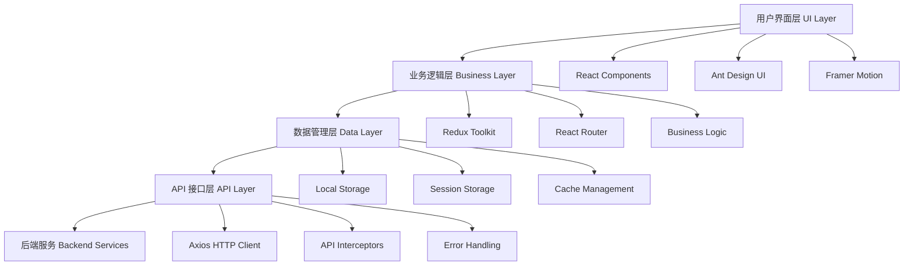
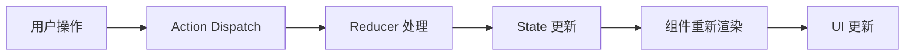
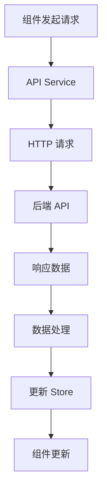

# 项目架构

## 🏗️ 整体架构

母婴商城管理后台采用现代化的前端架构设计，基于 React 生态系统构建，具有高可维护性、可扩展性和性能优化的特点。

### 架构图



## 🎯 设计原则

### 1. 模块化设计
- **组件化**: 采用 React 组件化开发，提高代码复用性
- **模块分离**: 按功能模块划分，降低耦合度
- **职责单一**: 每个模块专注于特定功能

### 2. 类型安全
- **TypeScript**: 全面使用 TypeScript 提供类型安全
- **接口定义**: 严格的接口类型定义
- **编译时检查**: 在编译阶段发现潜在问题

### 3. 状态管理
- **集中管理**: 使用 Redux Toolkit 集中管理应用状态
- **不可变性**: 保证状态的不可变性
- **可预测性**: 状态变化可预测和可追踪

### 4. 性能优化
- **懒加载**: 路由级别的代码分割
- **缓存策略**: 合理的数据缓存机制
- **虚拟化**: 大列表虚拟化渲染

## 🏛️ 分层架构

### 表现层 (Presentation Layer)
负责用户界面展示和交互处理

**主要组件:**
- React 组件
- Ant Design UI 组件
- 自定义业务组件
- 样式和主题

**职责:**
- 渲染用户界面
- 处理用户交互
- 展示数据和状态
- 路由导航

### 业务逻辑层 (Business Logic Layer)
处理业务规则和应用逻辑

**主要组件:**
- Redux Store 和 Slices
- 业务逻辑函数
- 数据转换和验证
- 权限控制

**职责:**
- 业务规则实现
- 数据处理和转换
- 状态管理
- 权限验证

### 数据访问层 (Data Access Layer)
负责数据获取和管理

**主要组件:**
- API 服务
- HTTP 客户端配置
- 数据缓存
- 本地存储

**职责:**
- API 接口调用
- 数据缓存管理
- 错误处理
- 请求拦截

## 🔧 技术栈详解

### 核心框架
```typescript
// React 19 - 前端框架
import React from 'react'
import { createRoot } from 'react-dom/client'

// TypeScript - 类型系统
interface UserInfo {
  id: number
  name: string
  role: string
}
```

### 状态管理
```typescript
// Redux Toolkit - 状态管理
import { configureStore, createSlice } from '@reduxjs/toolkit'

const userSlice = createSlice({
  name: 'user',
  initialState,
  reducers: {
    setUser: (state, action) => {
      state.userInfo = action.payload
    }
  }
})
```

### 路由管理
```typescript
// React Router - 路由管理
import { createBrowserRouter, RouterProvider } from 'react-router-dom'

const router = createBrowserRouter([
  {
    path: '/',
    element: <Layout />,
    children: [
      { path: 'dashboard', element: <Dashboard /> }
    ]
  }
])
```

### UI 组件库
```typescript
// Ant Design - UI 组件库
import { Button, Table, Form } from 'antd'
import { ConfigProvider } from 'antd'
import zhCN from 'antd/locale/zh_CN'
```

## 📁 目录结构

```
src/
├── api/                    # API 接口层
│   ├── modules/           # 按模块分组的 API
│   ├── types/             # API 类型定义
│   └── index.ts           # API 统一导出
├── assets/                # 静态资源
│   ├── images/            # 图片资源
│   ├── icons/             # 图标资源
│   └── fonts/             # 字体资源
├── components/            # 通用组件
│   ├── ui/                # 基础 UI 组件
│   ├── business/          # 业务组件
│   └── layout/            # 布局组件
├── hooks/                 # 自定义 Hooks
├── layout/                # 页面布局
├── router/                # 路由配置
├── store/                 # 状态管理
│   ├── slices/            # Redux Slices
│   └── index.ts           # Store 配置
├── styles/                # 样式文件
├── types/                 # TypeScript 类型定义
├── utils/                 # 工具函数
├── views/                 # 页面组件
│   ├── dashboard/         # 仪表盘
│   ├── user/              # 用户管理
│   ├── product/           # 商品管理
│   ├── order/             # 订单管理
│   └── ...                # 其他功能模块
└── main.tsx               # 应用入口
```

## 🔄 数据流

### 单向数据流


### API 数据流


## 🛡️ 安全架构

### 认证授权
- JWT Token 认证
- 路由权限控制
- API 接口权限验证
- 敏感操作二次确认

### 数据安全
- 输入数据验证
- XSS 防护
- CSRF 防护
- 敏感信息加密

## 📈 性能架构

### 代码分割
```typescript
// 路由级别懒加载
const Dashboard = lazy(() => import('@/views/dashboard'))
const UserList = lazy(() => import('@/views/user/list'))
```

### 缓存策略
- HTTP 缓存
- 内存缓存
- 本地存储缓存
- 组件级缓存

### 优化策略
- Bundle 分析和优化
- 图片懒加载
- 虚拟列表
- 防抖节流

---

*本文档描述了项目的整体架构设计，为开发团队提供技术指导和参考。*
