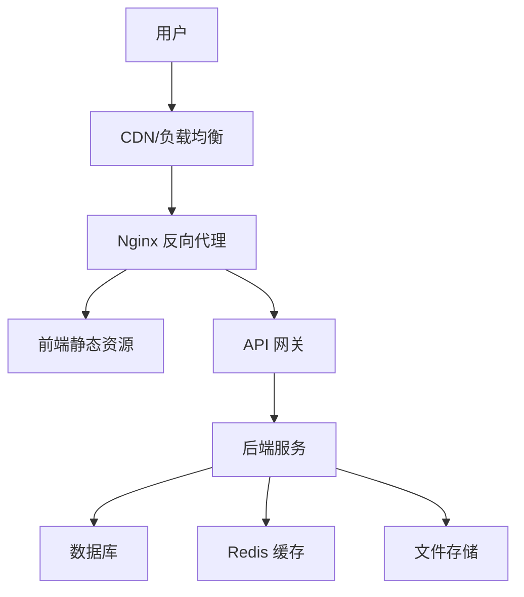

# 部署指南

## 🚀 部署概述

本文档详细说明了母婴商城管理后台的部署流程、环境配置和运维管理。

### 部署架构


## 🏗️ 环境要求

### 服务器配置
| 环境 | CPU | 内存 | 存储 | 带宽 |
|------|-----|------|------|------|
| 开发环境 | 2核 | 4GB | 50GB | 5Mbps |
| 测试环境 | 4核 | 8GB | 100GB | 10Mbps |
| 生产环境 | 8核 | 16GB | 200GB | 20Mbps |

### 软件依赖
- **Node.js**: >= 18.0.0
- **Nginx**: >= 1.18.0
- **PM2**: >= 5.0.0 (可选)
- **Docker**: >= 20.0.0 (可选)

## 📦 构建部署

### 1. 本地构建

#### 环境变量配置
```bash
# .env.production
VITE_API_BASE_URL=https://api.muying.com
VITE_APP_TITLE=母婴商城管理后台
VITE_USE_MOCK=false
VITE_UPLOAD_URL=https://api.muying.com/upload
VITE_WS_URL=wss://api.muying.com/ws
```

#### 构建命令
```bash
# 安装依赖
npm install

# 构建生产版本
npm run build

# 预览构建结果（可选）
npm run preview
```

#### 构建输出
```
dist/
├── assets/              # 静态资源
│   ├── css/            # 样式文件
│   ├── js/             # JavaScript 文件
│   └── images/         # 图片资源
├── index.html          # 入口 HTML
└── favicon.ico         # 网站图标
```

### 2. 服务器部署

#### 方式一：传统部署
```bash
# 1. 上传构建文件到服务器
scp -r dist/ user@server:/var/www/muying-admin/

# 2. 配置 Nginx
sudo vim /etc/nginx/sites-available/muying-admin

# 3. 启用站点
sudo ln -s /etc/nginx/sites-available/muying-admin /etc/nginx/sites-enabled/
sudo nginx -t
sudo systemctl reload nginx
```

#### 方式二：Docker 部署
```dockerfile
# Dockerfile
FROM nginx:alpine

# 复制构建文件
COPY dist/ /usr/share/nginx/html/

# 复制 Nginx 配置
COPY nginx.conf /etc/nginx/conf.d/default.conf

# 暴露端口
EXPOSE 80

# 启动 Nginx
CMD ["nginx", "-g", "daemon off;"]
```

```bash
# 构建 Docker 镜像
docker build -t muying-admin:latest .

# 运行容器
docker run -d \
  --name muying-admin \
  -p 80:80 \
  muying-admin:latest
```

## ⚙️ Nginx 配置

### 基础配置
```nginx
# /etc/nginx/sites-available/muying-admin
server {
    listen 80;
    server_name admin.muying.com;
    root /var/www/muying-admin/dist;
    index index.html;

    # Gzip 压缩
    gzip on;
    gzip_vary on;
    gzip_min_length 1024;
    gzip_types
        text/plain
        text/css
        text/xml
        text/javascript
        application/javascript
        application/xml+rss
        application/json;

    # 静态资源缓存
    location ~* \.(js|css|png|jpg|jpeg|gif|ico|svg)$ {
        expires 1y;
        add_header Cache-Control "public, immutable";
    }

    # HTML 文件不缓存
    location ~* \.html$ {
        expires -1;
        add_header Cache-Control "no-cache, no-store, must-revalidate";
    }

    # SPA 路由支持
    location / {
        try_files $uri $uri/ /index.html;
    }

    # API 代理
    location /api/ {
        proxy_pass http://backend-server;
        proxy_set_header Host $host;
        proxy_set_header X-Real-IP $remote_addr;
        proxy_set_header X-Forwarded-For $proxy_add_x_forwarded_for;
        proxy_set_header X-Forwarded-Proto $scheme;
    }

    # WebSocket 代理
    location /ws/ {
        proxy_pass http://backend-server;
        proxy_http_version 1.1;
        proxy_set_header Upgrade $http_upgrade;
        proxy_set_header Connection "upgrade";
        proxy_set_header Host $host;
    }
}
```

### HTTPS 配置
```nginx
server {
    listen 443 ssl http2;
    server_name admin.muying.com;
    
    # SSL 证书配置
    ssl_certificate /path/to/certificate.crt;
    ssl_certificate_key /path/to/private.key;
    
    # SSL 安全配置
    ssl_protocols TLSv1.2 TLSv1.3;
    ssl_ciphers ECDHE-RSA-AES128-GCM-SHA256:ECDHE-RSA-AES256-GCM-SHA384;
    ssl_prefer_server_ciphers off;
    
    # HSTS
    add_header Strict-Transport-Security "max-age=63072000" always;
    
    # 其他配置同上...
}

# HTTP 重定向到 HTTPS
server {
    listen 80;
    server_name admin.muying.com;
    return 301 https://$server_name$request_uri;
}
```

## 🔧 环境变量管理

### 环境变量文件
```bash
# .env.development - 开发环境
VITE_API_BASE_URL=http://localhost:8080/api
VITE_APP_TITLE=母婴商城管理后台（开发）
VITE_USE_MOCK=true

# .env.staging - 测试环境
VITE_API_BASE_URL=https://api-staging.muying.com
VITE_APP_TITLE=母婴商城管理后台（测试）
VITE_USE_MOCK=false

# .env.production - 生产环境
VITE_API_BASE_URL=https://api.muying.com
VITE_APP_TITLE=母婴商城管理后台
VITE_USE_MOCK=false
```

### 环境变量说明
| 变量名 | 说明 | 示例值 |
|--------|------|--------|
| `VITE_API_BASE_URL` | API 基础地址 | `https://api.muying.com` |
| `VITE_APP_TITLE` | 应用标题 | `母婴商城管理后台` |
| `VITE_USE_MOCK` | 是否使用 Mock 数据 | `false` |
| `VITE_UPLOAD_URL` | 文件上传地址 | `https://api.muying.com/upload` |
| `VITE_WS_URL` | WebSocket 地址 | `wss://api.muying.com/ws` |

## 📊 监控和日志

### Nginx 日志配置
```nginx
# 访问日志格式
log_format main '$remote_addr - $remote_user [$time_local] "$request" '
                '$status $body_bytes_sent "$http_referer" '
                '"$http_user_agent" "$http_x_forwarded_for"';

# 日志文件
access_log /var/log/nginx/muying-admin.access.log main;
error_log /var/log/nginx/muying-admin.error.log;
```

### 日志分析
```bash
# 查看访问日志
tail -f /var/log/nginx/muying-admin.access.log

# 分析访问统计
awk '{print $1}' /var/log/nginx/muying-admin.access.log | sort | uniq -c | sort -nr | head -10

# 分析状态码
awk '{print $9}' /var/log/nginx/muying-admin.access.log | sort | uniq -c | sort -nr
```

### 性能监控
```bash
# 安装监控工具
npm install -g pm2

# 使用 PM2 管理进程（如果有 Node.js 服务）
pm2 start ecosystem.config.js
pm2 monit
```

## 🔄 CI/CD 流程

### GitHub Actions 示例
```yaml
# .github/workflows/deploy.yml
name: Deploy to Production

on:
  push:
    branches: [main]

jobs:
  build-and-deploy:
    runs-on: ubuntu-latest
    
    steps:
    - name: Checkout code
      uses: actions/checkout@v3
      
    - name: Setup Node.js
      uses: actions/setup-node@v3
      with:
        node-version: '18'
        cache: 'npm'
        
    - name: Install dependencies
      run: npm ci
      
    - name: Build application
      run: npm run build
      env:
        VITE_API_BASE_URL: ${{ secrets.API_BASE_URL }}
        
    - name: Deploy to server
      uses: appleboy/ssh-action@v0.1.5
      with:
        host: ${{ secrets.HOST }}
        username: ${{ secrets.USERNAME }}
        key: ${{ secrets.SSH_KEY }}
        script: |
          cd /var/www/muying-admin
          rm -rf dist
          mkdir dist
          
    - name: Upload files
      uses: appleboy/scp-action@v0.1.4
      with:
        host: ${{ secrets.HOST }}
        username: ${{ secrets.USERNAME }}
        key: ${{ secrets.SSH_KEY }}
        source: "dist/*"
        target: "/var/www/muying-admin/"
        
    - name: Restart Nginx
      uses: appleboy/ssh-action@v0.1.5
      with:
        host: ${{ secrets.HOST }}
        username: ${{ secrets.USERNAME }}
        key: ${{ secrets.SSH_KEY }}
        script: sudo systemctl reload nginx
```

## 🛡️ 安全配置

### 安全头设置
```nginx
# 安全头配置
add_header X-Frame-Options "SAMEORIGIN" always;
add_header X-Content-Type-Options "nosniff" always;
add_header X-XSS-Protection "1; mode=block" always;
add_header Referrer-Policy "strict-origin-when-cross-origin" always;
add_header Content-Security-Policy "default-src 'self'; script-src 'self' 'unsafe-inline'; style-src 'self' 'unsafe-inline';" always;
```

### 访问控制
```nginx
# IP 白名单（可选）
location /admin {
    allow 192.168.1.0/24;
    allow 10.0.0.0/8;
    deny all;
}

# 限制请求频率
limit_req_zone $binary_remote_addr zone=api:10m rate=10r/s;
location /api/ {
    limit_req zone=api burst=20 nodelay;
}
```

## 🔧 故障排查

### 常见问题

#### 1. 页面无法访问
```bash
# 检查 Nginx 状态
sudo systemctl status nginx

# 检查 Nginx 配置
sudo nginx -t

# 查看错误日志
sudo tail -f /var/log/nginx/error.log
```

#### 2. 静态资源 404
```bash
# 检查文件权限
ls -la /var/www/muying-admin/dist/

# 修改文件权限
sudo chown -R www-data:www-data /var/www/muying-admin/
sudo chmod -R 755 /var/www/muying-admin/
```

#### 3. API 请求失败
```bash
# 检查后端服务状态
curl -I http://backend-server/api/health

# 检查代理配置
sudo nginx -T | grep -A 10 "location /api"
```

### 性能优化

#### 1. 启用 HTTP/2
```nginx
listen 443 ssl http2;
```

#### 2. 优化缓存策略
```nginx
# 静态资源长期缓存
location ~* \.(js|css|png|jpg|jpeg|gif|ico|svg|woff|woff2)$ {
    expires 1y;
    add_header Cache-Control "public, immutable";
}
```

#### 3. 启用 Brotli 压缩
```nginx
# 安装 nginx-module-brotli
load_module modules/ngx_http_brotli_filter_module.so;
load_module modules/ngx_http_brotli_static_module.so;

# 配置 Brotli
brotli on;
brotli_comp_level 6;
brotli_types text/plain text/css application/json application/javascript text/xml application/xml application/xml+rss text/javascript;
```

---

*本文档提供了完整的部署指南，确保应用能够稳定、安全地运行在生产环境中。*
