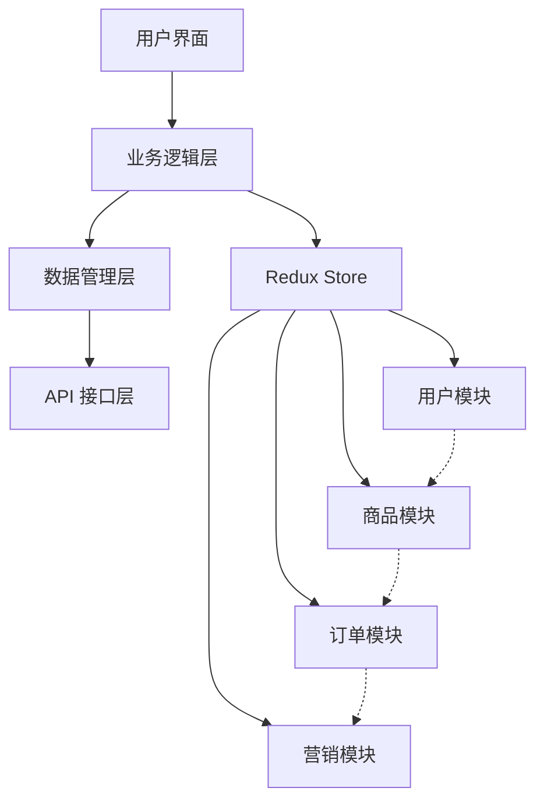
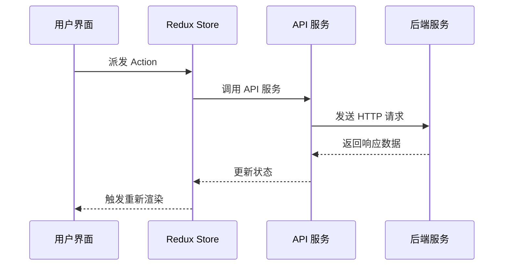
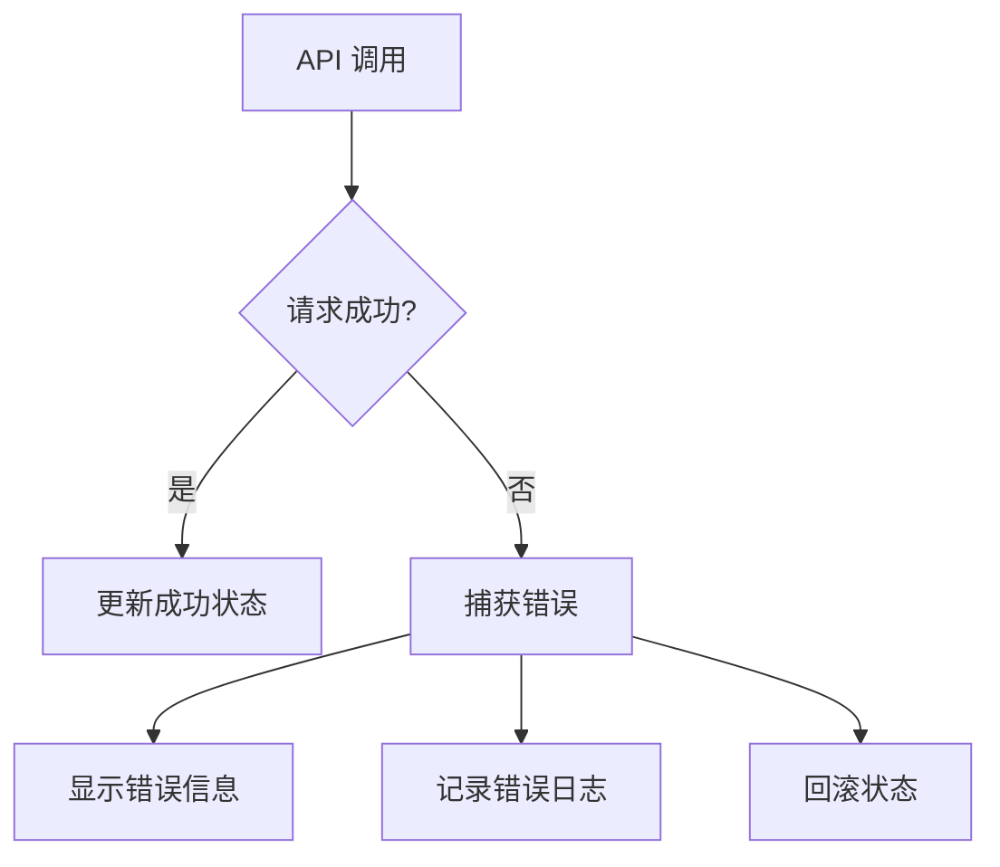

# 功能模块文档

## 📋 模块概览

母婴商城管理后台包含以下主要功能模块：

### 🏠 核心模块
- [仪表盘](./dashboard.md) - 数据概览和关键指标
- [用户管理](./user-management.md) - 用户信息和权限管理
- [商品管理](./product-management.md) - 商品、分类、品牌管理
- [订单管理](./order-management.md) - 订单处理和跟踪

### 🎯 营销模块
- [优惠券管理](./coupon-management.md) - 优惠券创建和发放
- [积分系统](./points-system.md) - 积分规则和兑换
- [营销活动](./marketing.md) - 促销活动管理

### 📊 分析模块
- [数据分析](./analytics.md) - 多维度数据分析
- [报表系统](./reports.md) - 自定义报表和导出

### 🔧 系统模块
- [物流管理](./logistics.md) - 物流公司和跟踪
- [售后管理](./after-sales.md) - 售后服务处理
- [评论管理](./comment-management.md) - 用户评论审核
- [消息管理](./message-management.md) - 系统消息和通知
- [系统管理](./system.md) - 系统配置和监控

## 🎯 模块架构

### 模块设计原则
1. **单一职责**: 每个模块专注于特定业务领域
2. **松耦合**: 模块间依赖最小化
3. **高内聚**: 模块内部功能紧密相关
4. **可扩展**: 支持功能扩展和定制

### 模块通信方式


## 📁 模块结构

### 标准模块结构
```
src/views/[module]/
├── components/          # 模块专用组件
│   ├── [Component]/
│   │   ├── index.tsx
│   │   ├── [Component].tsx
│   │   └── [Component].test.tsx
├── hooks/              # 模块专用 Hooks
│   ├── use[Module].ts
│   └── use[Feature].ts
├── types/              # 模块类型定义
│   └── index.ts
├── utils/              # 模块工具函数
│   └── index.ts
├── [feature].tsx       # 功能页面
├── list.tsx           # 列表页面
├── detail.tsx         # 详情页面
├── form.tsx           # 表单页面
└── index.tsx          # 模块入口
```

### 状态管理结构
```
src/store/slices/[module]Slice.ts
├── State Interface     # 状态接口定义
├── Initial State      # 初始状态
├── Async Thunks       # 异步操作
├── Slice Definition   # Slice 定义
└── Selectors          # 状态选择器
```

## 🔄 数据流

### 标准数据流程


### 错误处理流程


## 🎨 UI 设计规范

### 页面布局标准
```typescript
// 标准页面布局
const ModulePage: React.FC = () => {
  return (
    <div className="module-page">
      {/* 页面头部 */}
      <div className="page-header">
        <h1 className="page-title">模块标题</h1>
        <div className="page-actions">
          {/* 操作按钮 */}
        </div>
      </div>
      
      {/* 筛选区域 */}
      <div className="filter-section">
        {/* 筛选表单 */}
      </div>
      
      {/* 内容区域 */}
      <div className="content-section">
        {/* 主要内容 */}
      </div>
      
      {/* 分页区域 */}
      <div className="pagination-section">
        {/* 分页组件 */}
      </div>
    </div>
  )
}
```

### 组件设计规范
- **列表组件**: 支持筛选、排序、分页
- **表单组件**: 支持验证、提交、重置
- **详情组件**: 支持查看、编辑、操作
- **统计组件**: 支持图表、导出、刷新

## 🔐 权限控制

### 模块权限设计
```typescript
// 权限配置
const modulePermissions = {
  user: {
    view: 'user:view',
    create: 'user:create',
    edit: 'user:edit',
    delete: 'user:delete'
  },
  product: {
    view: 'product:view',
    create: 'product:create',
    edit: 'product:edit',
    delete: 'product:delete'
  }
}

// 权限检查 Hook
const usePermission = (permission: string) => {
  const { userInfo } = useSelector((state: RootState) => state.user)
  return userInfo?.permissions?.includes(permission) || false
}
```

### 路由权限控制
```typescript
// 权限路由组件
const PermissionRoute: React.FC<{
  permission: string
  children: React.ReactNode
}> = ({ permission, children }) => {
  const hasPermission = usePermission(permission)
  
  if (!hasPermission) {
    return <NoPermission />
  }
  
  return <>{children}</>
}
```

## 📊 性能优化

### 模块级优化策略
1. **代码分割**: 按模块进行懒加载
2. **状态优化**: 避免不必要的状态更新
3. **组件优化**: 使用 React.memo 和 useMemo
4. **数据缓存**: 合理使用数据缓存

### 懒加载实现
```typescript
// 模块懒加载
const UserManagement = lazy(() => import('@/views/user'))
const ProductManagement = lazy(() => import('@/views/product'))
const OrderManagement = lazy(() => import('@/views/order'))

// 路由配置
const routes = [
  {
    path: '/user',
    element: <Suspense fallback={<Loading />}><UserManagement /></Suspense>
  }
]
```

## 🧪 测试策略

### 模块测试覆盖
- **单元测试**: 组件和工具函数测试
- **集成测试**: 模块间交互测试
- **E2E 测试**: 完整业务流程测试

### 测试示例
```typescript
// 模块组件测试
describe('UserList Component', () => {
  it('should render user list correctly', () => {
    const mockUsers = [
      { id: 1, name: 'John', email: 'john@example.com' }
    ]
    
    render(<UserList users={mockUsers} />)
    expect(screen.getByText('John')).toBeInTheDocument()
  })
})
```

## 📈 监控和日志

### 模块监控指标
- **性能指标**: 页面加载时间、API 响应时间
- **业务指标**: 用户操作频率、错误率
- **用户体验**: 页面停留时间、操作成功率

### 日志记录
```typescript
// 操作日志记录
const logUserAction = (action: string, details: any) => {
  console.log(`[${new Date().toISOString()}] ${action}:`, details)
  
  // 发送到日志服务
  logService.record({
    timestamp: new Date(),
    action,
    details,
    userId: getCurrentUserId()
  })
}
```

---

*本文档提供了功能模块的整体架构和设计规范，为各个具体模块的开发提供指导。*
